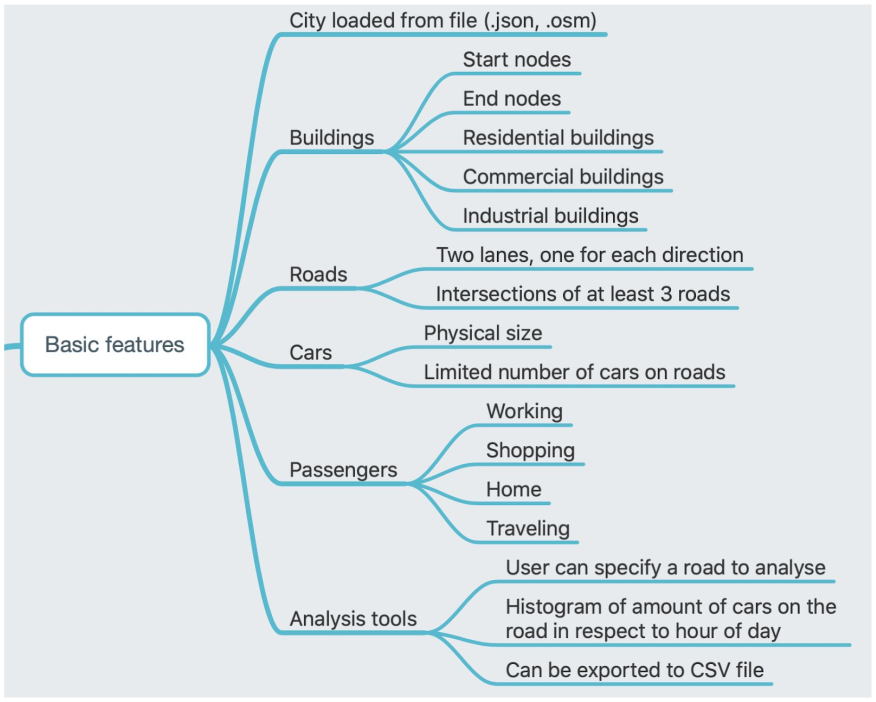
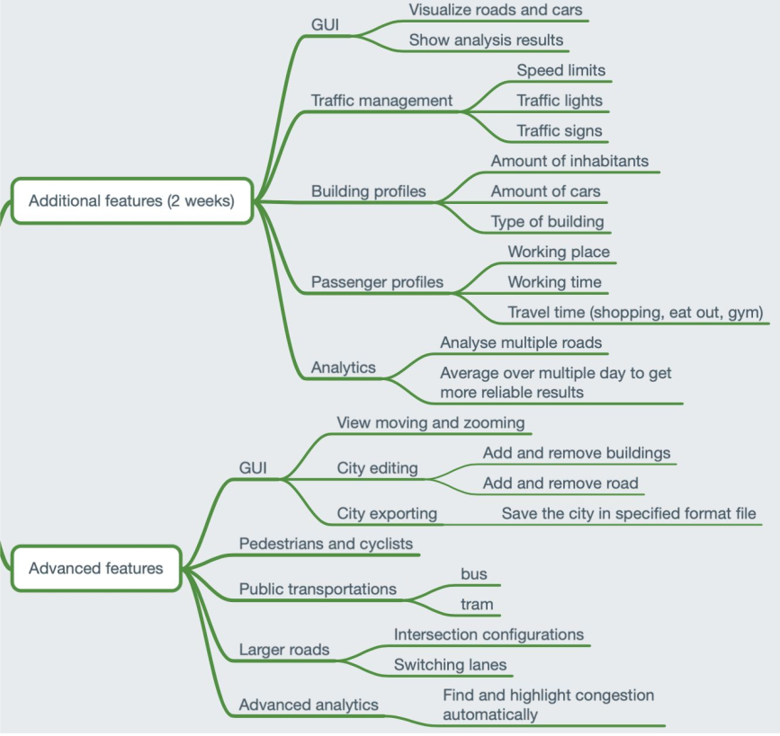
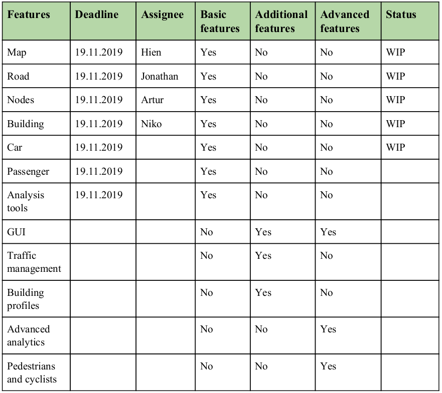

# Traffic simulator - Project plan #

Collaborators: 
Jonathan Leinola - 477329 
Niko Uski - 51961T 
Artur Gynter - 569499 
Hien Cao - 716718 
 
 
## Project description: ##

This project is developed during the span of the course ELEC - A7151 - Object-Oriented Programming with C++. The topic is about traffic simulator. The topic description and goal are copied from the course material which is simulating and analyzing city traffic can be useful for example when one wants to predict traffic jams or estimate the effect of new roads. 

Numerous different factors make traffic a highly nonlinear, almost chaotic system. The goal of this project is to create configurable traffic simulator and analysis tools for it. To ease development and maintenance, the application structure is described in Figure 1.

Figure 1: Structure of the application
 
 
 
To support the application, we plan to use external libraries SFML, ImGui, and ImGui + SFML. The link for the mentioned libraries is below:
 
SFML - https://github.com/SFML/SFML
 
ImGui - https://github.com/ocornut/imgui
 
ImGui + SFML - https://github.com/eliasdaler/imgui-sfml
 
 
 
## Basic features: ##

The minimal feature requirements are presented in figure 2. It is divided into 6 different classes and the workload of them is separated between our team in the 4th section of this document “collaboration and contribution”. We have agreed on some common practices to use c++11 as a base standard for the code and apply the coding style, file naming, etc learned from the course to the project. Of course, the rule number one is to never commit broken code. In addition, to commit small units at a time is considered as a good practice.

Figure 2: Basic features of the software
 
 
 
## Additional features and advanced features: ##

Our goal is to make additional features on top of basic features. For example, our analysis software should be capable of processing small cities or parts of big cities. We plan to Implement a GUI using SFML and additional libraries for it as mentioned in the project description. The GUIs’ purpose is to visualize roads and cars and show results from the analysis. On top of that, there should be traffic management and building profiles. The advanced features are not discussed in this phase of the project and are to be planned.

Figure 3: Additional features and advanced features
 
 
 
## Collaboration and contribution ##

Order of work:
We are going to have face-to-face meetings regularly to update the status of the development. In addition, we will use Telegram for group communication and Courses Git to manage the application development. The workload is divided in the figure 4, which contains some of the additional and advanced features too.

Figure 4: Timetable
 
 
 
## Project timeline ##

Figure 5: Timeline

Figure 6: Project schedule

